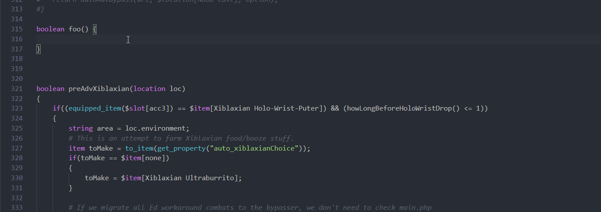
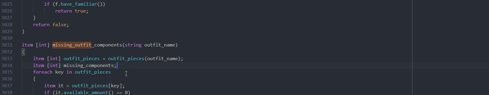
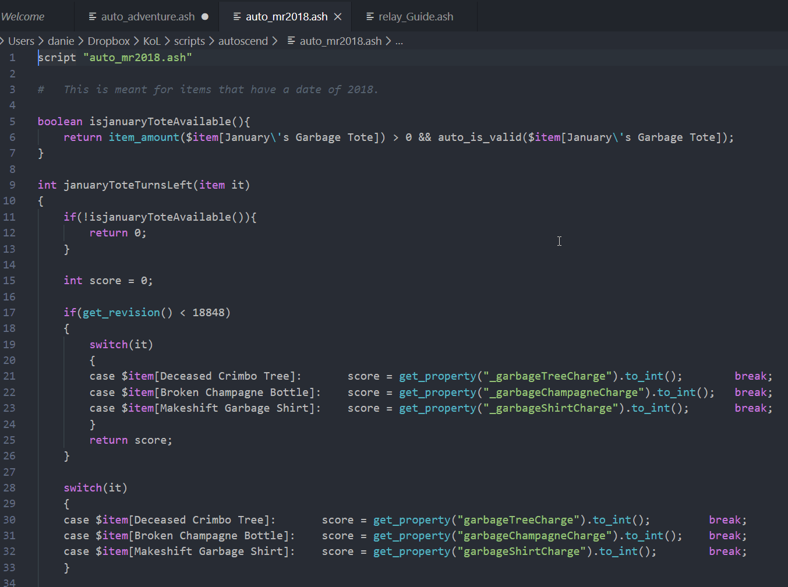

# KoLmafia ASH++

Language definition for the [KoLmafia ASH](https://wiki.kolmafia.us/index.php?title=Main_Page) language, a scripting language for the
game [Kingdom of Loathing](https://www.kingdomofloathing.com/).

Forked from [https://github.com/benblank/kolmafia-ash](https://github.com/benblank/kolmafia-ash).

## Features

* **Syntax Highlighting**

    

* **Autosuggest & completion for ASH functions**

    

* **Hover tooltips for ASH functions**

    

* **Symbol Definitions**

    

## Known Issues/Limitations

* The symbol parser is currently quite brittle, and there are many things that can cause it to break (this only affects the symbol definition
  feature). These include:
    * Method calls on integers (e.g. `123.to_skill()`)
    * Function body without brackets around it
    * ASH record data structures
    * Template strings

## Changelog

See [CHANGELOG](CHANGELOG.md) for more information.

